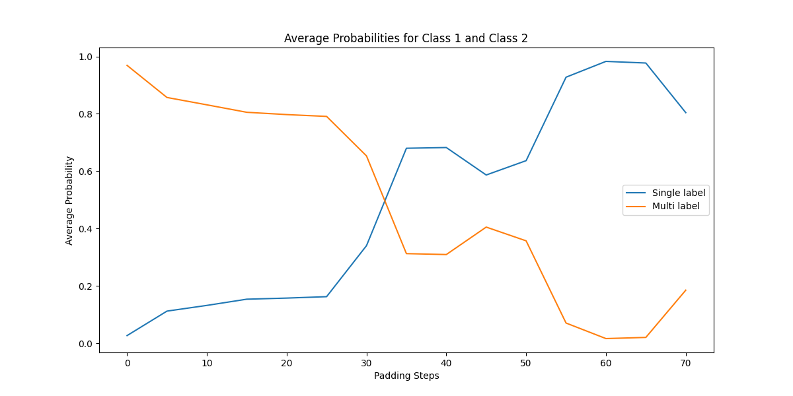
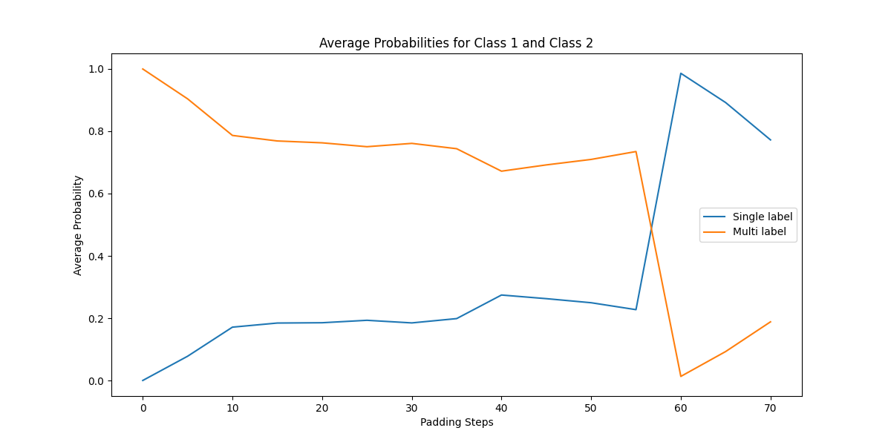

# Experiment Report

## Windowing probability experiment
Exploring the Impact of Image Padding on Multicrop Classification Probability in Satellite Image Time Series (SITS), when padding the images. from front to back.

---

## Objective
To investigate how progressive padding of satellite image time series (SITS) affects the model’s classification probability for multicrop fields. Specifically, the hypothesis is that increasing padding around the images will lead to a decrease in the model's confidence in assigning a multicrop label, as the probability of a singlecrop label increased. 

---

## Methodology
1. Initialize the model with architecture and load weights.
2. Run the model on unpadded images to establish baseline probabilities.
3. Incrementally apply padding in 5-step intervals, rerunning the model at each stage.
4. Repeat step by steps, but instead of 
4. Plot and analyze the resulting softmax probabilities to observe changes in crop classification.

---

## Results
As shown the in the following figures the padding works well when doing it forward, but for some reason it is weird when windowing backwards.

**Front Padding probability changes:**

**Back Padding probability changes:**

---

## Next Steps
1. Train a single class model, and see how this type of input will behave.
2. Treat the multicrop as classes.

---

