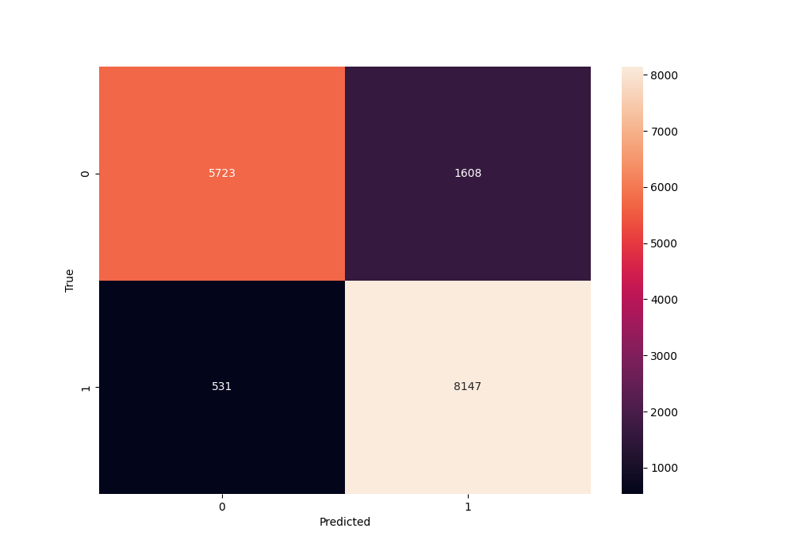

# Experiment Results Documentation

---

## 1. Dataset

- **Name**: FastFarm
- **Source**: Sentinel-2
- **Number of Samples**: 193
- **Resolution**: 10m
- **Bands**: 10 sentinel bands
- **Area of Interest (AOI)**: To be added.

---

## 2. Preprocessing

- **Steps**: 
  - 
- **Tools Used**: Python script
- **Remarks**: Raw dataset

---

## 3. Satellite Information

- Satellite Name: Sentinel-2
- Date Range: November 2022 to November 2024
- Spatial Resolution: 10 meters
- Temporal Resolution: 5 days revisit

---

## 4. Model

- **Model Architecture**: TSVIT
- **Input Size**: 73 x 24 x 24
- **Number of Layers**: 
- **Number of Parameters**: NA
- **Optimizer**: Adam
- **Learning Rate**: 0.0001
- **Loss Function**: Cross entropy loss
- **Batch Size**: 2
- **Epochs**: 50
- **Hyper Params**:{
    "patch_size": patch_size,
    "patch_size_time": 1,
    "patch_time": 4,
    "dim": 128,
    "temporal_depth": 6,
    "spatial_depth": 2,
    "channel_depth": 4,
    "heads": 4,
    "dim_head": 64,
    "dropout": 0.0,
    "emb_dropout": 0.0,
    "scale_dim": 4,
    "depth": 4,
}

---

## 5. Results

- **Accuracy**:  86.63%
- **MIOU**: 75.99 %
- **F1 Score**: 86.32 %
- **Training Time**: 15 minutes
- **Crop Results**: [Results](../csvs/fastfarm_binary_results.csv)
- **Test Loss**:
- **Confusion Matrix**: 

---

## 6. Observations

- **Strengths** Easy to run, and test the hipotesis the multicrop is diferent than single crop.
- **Weaknesses**: I only cutted images above 73 images, becauseall the images had similar ranges.
- **Further Improvements**: We need to start adding more classes to the model to start predicting more things, and add background.

